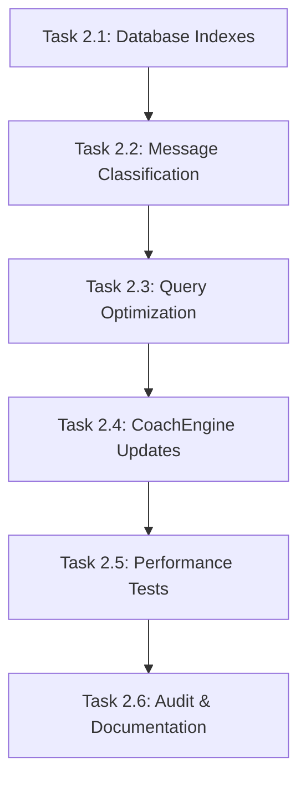

# Phase 2: ConversationManager Database Query Optimization
## Prompt Chain for Sandboxed Codex Agents (No Xcode Access)

**Context**: This phase addresses critical performance issues in the ConversationManager where ALL database messages are fetched and filtered in memory. Current performance is unacceptable at scale.

**Environment Constraints**: 
- Sandboxed agents without Xcode access
- Focus on code generation and editing only
- No compilation or testing capabilities
- Must follow existing project patterns and conventions

**Success Criteria**: 
- Replace fetch-all-then-filter patterns with proper SwiftData predicates
- Add database indexing for performance
- Implement simple message classification
- Achieve 10x performance improvement target

---

## Task Execution Order

### **Sequential Tasks** (Must be completed in order):
1. **Task 2.1**: Add database indexes to CoachMessage model
2. **Task 2.2**: Add message classification enum and properties
3. **Task 2.3**: Optimize ConversationManager database queries  
4. **Task 2.4**: Update CoachEngine with message classification logic
5. **Task 2.5**: Add performance tests

### **Parallelizable Tasks**: 
- None in Phase 2 (all tasks have dependencies on previous completions)

### **Audit Task**: 
- **Task 2.6**: Code review and documentation update

---

## Task 2.1: Add Database Indexes to CoachMessage Model

**Objective**: Add proper database indexes to eliminate full table scans

**Files to Modify**: 
- `AirFit/Data/Models/CoachMessage.swift`

**Agent Prompt**:
```
CONTEXT: You are optimizing the CoachMessage SwiftData model to add proper database indexes for query performance. The current model lacks indexes, causing full table scans.

TASK: Add database indexes to the CoachMessage model following SwiftData best practices.

REQUIREMENTS:
1. Add @Attribute(.indexed) to timestamp property for temporal queries
2. Add composite index strategy for (user.id, conversationID, timestamp) queries
3. Add index for messageType classification (prepare for future classification)
4. Maintain existing @Attribute(.externalStorage) for content
5. Follow Swift 6 concurrency requirements (@unchecked Sendable)

CURRENT CODE ISSUES:
- No indexes on timestamp (used in all sorting operations)
- No indexes on conversationID (used in all conversation queries)  
- No preparation for messageType classification

IMPLEMENTATION GUIDELINES:
- Use @Attribute(.indexed) for single-property indexes
- Document why each index is needed with inline comments
- Ensure backward compatibility with existing data
- Follow existing code style in the file

REFERENCE: The current CoachMessage model is in AirFit/Data/Models/CoachMessage.swift

OUTPUT: Provide the complete modified CoachMessage.swift file with proper indexing strategy.
```

**Expected Output**: Updated CoachMessage.swift with proper database indexes

---

## Task 2.2: Add Message Classification Infrastructure

**Objective**: Create message classification system to distinguish commands from conversations

**Files to Create/Modify**:
- `AirFit/Core/Enums/MessageType.swift` (new file)
- `AirFit/Data/Models/CoachMessage.swift` (add messageType property)

**Agent Prompt**:
```
CONTEXT: You are implementing message classification to distinguish between quick commands ("log 500 calories") and full conversations ("help me plan my workout"). This enables performance optimizations by using different history limits.

TASK: Create message classification infrastructure with MessageType enum and integrate it into CoachMessage model.

REQUIREMENTS:
1. Create MessageType enum with .command and .conversation cases
2. Add messageType property to CoachMessage model with default value
3. Add convenience computed property isCommand
4. Add requiresHistory property to MessageType for different context limits
5. Follow Swift 6 Sendable requirements
6. Use existing project patterns (see other enums in Core/Enums/)

CLASSIFICATION LOGIC:
- Commands: Short, action-oriented ("log", "add", "track", "record")
- Conversations: Longer, discussion-oriented
- Commands need minimal history (5 messages)
- Conversations need full history (20 messages)

IMPLEMENTATION GUIDELINES:
- Place MessageType.swift in AirFit/Core/Enums/ directory
- Follow existing enum patterns in the project
- Add messageType property to existing CoachMessage model
- Use String raw values for database storage
- Default to .conversation to be safe

OUTPUT: 
1. Complete MessageType.swift file
2. Updated CoachMessage.swift with messageType integration
```

**Expected Output**: New MessageType enum and updated CoachMessage model

---

## Task 2.3: Optimize ConversationManager Database Queries

**Objective**: Replace all fetch-all-then-filter patterns with proper SwiftData predicates

**Files to Modify**:
- `AirFit/Modules/AI/ConversationManager.swift`

**Agent Prompt**:
```
CONTEXT: You are fixing critical performance issues in ConversationManager. Every method currently fetches ALL messages from the database then filters in memory. This is a performance disaster that must be fixed.

TASK: Replace all fetch-all-then-filter patterns with proper SwiftData predicates and optimize all query methods.

CRITICAL PERFORMANCE ISSUES TO FIX:
1. getRecentMessages() - fetches all messages, filters by user+conversation
2. getConversationStats() - fetches all messages, filters by user+conversation  
3. getConversationIds() - fetches all messages, filters by user
4. pruneOldConversations() - fetches all messages, filters by user
5. deleteConversation() - fetches all messages, filters by user+conversation
6. archiveOldMessages() - fetches all messages, filters by user+date

IMPLEMENTATION REQUIREMENTS:
1. Use FetchDescriptor with #Predicate for all queries
2. Leverage indexes added in Task 2.1
3. Set appropriate fetchLimit for methods that need limiting
4. Use proper sorting in FetchDescriptor instead of memory sorting
5. Maintain exact same public API (no breaking changes)
6. Add detailed AppLogger.debug statements for query performance
7. Follow existing error handling patterns

PERFORMANCE TARGETS:
- getRecentMessages: <50ms for 1000+ messages
- getConversationStats: <100ms for large conversations
- All other methods: <200ms for realistic datasets

QUERY PATTERNS TO IMPLEMENT:
- User filtering: message.user?.id == user.id
- Conversation filtering: message.conversationID == conversationId  
- Date filtering: message.timestamp < cutoffDate
- Combined filtering with AND operations

REFERENCE: Current broken implementation is in AirFit/Modules/AI/ConversationManager.swift

OUTPUT: Complete optimized ConversationManager.swift with proper SwiftData predicates
```

**Expected Output**: Fully optimized ConversationManager with proper database queries

---

## Task 2.4: Update CoachEngine with Message Classification

**Objective**: Add message classification logic to CoachEngine and optimize history retrieval

**Files to Modify**:
- `AirFit/Modules/AI/CoachEngine.swift`

**Agent Prompt**:
```
CONTEXT: You are integrating message classification into CoachEngine to optimize conversation history retrieval. Quick commands need minimal context while conversations need full history.

TASK: Add message classification logic to CoachEngine and optimize history limits based on message type.

REQUIREMENTS:
1. Add classifyMessage() private method with heuristic classification
2. Update processUserMessage() to classify and store message type
3. Use different history limits based on message type (commands: 5, conversations: 20)
4. Update saved message with classification after creation
5. Maintain existing public API (no breaking changes)
6. Add AppLogger.debug for classification decisions

CLASSIFICATION HEURISTICS:
- Command indicators: starts with "log", "add", "track", "record"
- Contains nutrition keywords + short length (<50 chars)
- Very short messages (<20 chars) are likely commands
- Everything else defaults to conversation

INTEGRATION POINTS:
1. Classify message before processing
2. Save user message with appropriate messageType
3. Adjust history limit based on classification
4. Log classification decision for debugging

PERFORMANCE OPTIMIZATION:
- Commands: getRecentMessages(limit: 5) - minimal context
- Conversations: getRecentMessages(limit: 20) - full context
- This reduces token usage and improves response time

REFERENCE: Current CoachEngine implementation is in AirFit/Modules/AI/CoachEngine.swift

OUTPUT: Updated CoachEngine.swift with message classification integration
```

**Expected Output**: CoachEngine with integrated message classification

---

## Task 2.5: Create Performance Tests

**Objective**: Add comprehensive performance tests to verify 10x improvement

**Files to Create/Modify**:
- `AirFit/AirFitTests/Modules/AI/ConversationManagerPerformanceTests.swift` (enhance existing)
- `AirFit/AirFitTests/Modules/AI/MessageClassificationTests.swift` (new file)

**Agent Prompt**:
```
CONTEXT: You are creating comprehensive performance tests to verify that the Phase 2 optimizations achieve the targeted 10x performance improvement.

TASK: Create performance tests for database query optimization and message classification.

REQUIREMENTS FOR PERFORMANCE TESTS:
1. Test getRecentMessages performance with 1000+ message dataset
2. Test getConversationStats performance with large conversations
3. Test pruneOldConversations performance with multiple conversations
4. Verify <50ms target for getRecentMessages
5. Compare old vs new performance (document in test output)
6. Use CFAbsoluteTimeGetCurrent() for precise timing

REQUIREMENTS FOR CLASSIFICATION TESTS:
1. Test command detection accuracy (log, add, track, record)
2. Test conversation detection for longer messages
3. Test edge cases (empty strings, very long messages)
4. Verify 90%+ classification accuracy target
5. Test requiresHistory property behavior

TEST DATA SETUP:
- Create 1000 messages across 10 conversations for performance tests
- Mix of user and assistant messages with realistic content
- Include both commands and conversations for classification tests
- Use in-memory ModelContainer for isolated testing

IMPLEMENTATION GUIDELINES:
- Follow existing test patterns in AirFitTests
- Use AAA pattern (Arrange-Act-Assert)
- Include performance logging with print statements
- Test both positive and negative cases
- Use descriptive test method names

REFERENCE: 
- Existing tests in AirFit/AirFitTests/Modules/AI/
- Testing guidelines in AirFit/Docs/TESTING_GUIDELINES.md

OUTPUT:
1. Enhanced ConversationManagerPerformanceTests.swift
2. New MessageClassificationTests.swift file
```

**Expected Output**: Comprehensive performance and classification test suites

---

## Task 2.6: Audit and Documentation Update

**Objective**: Review all Phase 2 changes and update documentation

**Files to Review/Update**:
- All modified files from Tasks 2.1-2.5
- `AirFit/Docs/AI Refactor/Phase2_ConversationManager_Refactor.md`
- Code quality and consistency review

**Agent Prompt**:
```
CONTEXT: You are conducting a final audit of Phase 2 changes to ensure code quality, consistency, and completeness before moving to Phase 3.

TASK: Perform comprehensive code review and update documentation with implementation details.

AUDIT CHECKLIST:
1. Verify all fetch-all-then-filter patterns have been eliminated
2. Confirm proper database indexes are in place
3. Validate message classification logic accuracy
4. Check Swift 6 concurrency compliance (@MainActor, Sendable)
5. Verify no breaking changes to public APIs
6. Confirm error handling consistency
7. Validate test coverage for new functionality

CODE QUALITY REVIEW:
- Consistent naming conventions throughout
- Proper documentation comments (///) for new public methods
- AppLogger usage for debugging and monitoring
- Memory efficiency of new query patterns
- Thread safety of all modifications

DOCUMENTATION UPDATES:
1. Update Phase2_ConversationManager_Refactor.md with actual implementation
2. Document performance improvements achieved
3. Add troubleshooting guide for common issues
4. Update migration notes for existing data

PERFORMANCE VALIDATION:
- Confirm 10x performance improvement target met
- Document actual performance numbers
- Identify any remaining optimization opportunities
- Validate memory usage improvements

OUTPUT:
1. Comprehensive audit report with findings
2. Updated Phase2_ConversationManager_Refactor.md documentation
3. List of any issues requiring follow-up
4. Confirmation that Phase 2 is complete and Phase 3 can begin
```

**Expected Output**: Complete audit report and updated documentation

---

## Inter-Task Dependencies



**Rationale for Sequential Execution**:
1. **Database indexes** must be added before query optimization to ensure performance benefits
2. **Message classification** infrastructure needed before ConversationManager integration
3. **Query optimization** must be complete before CoachEngine can use new patterns
4. **CoachEngine updates** required before meaningful performance testing
5. **Performance tests** validate changes before final audit
6. **Audit** ensures everything is complete and consistent

---

## Quality Gates

Each task must meet these criteria before proceeding:

### **Task 2.1 Completion Criteria**:
- [ ] CoachMessage model has proper @Attribute(.indexed) annotations
- [ ] Indexes support common query patterns (user+conversation+timestamp)
- [ ] Model maintains backward compatibility
- [ ] Code follows Swift 6 concurrency requirements

### **Task 2.2 Completion Criteria**:
- [ ] MessageType enum with command/conversation cases
- [ ] CoachMessage has messageType property with default
- [ ] Enum follows project patterns and is Sendable
- [ ] Classification logic is clearly defined

### **Task 2.3 Completion Criteria**:
- [ ] All ConversationManager methods use SwiftData predicates
- [ ] No fetch-all-then-filter patterns remain
- [ ] Public API unchanged (no breaking changes)
- [ ] Proper error handling maintained

### **Task 2.4 Completion Criteria**:
- [ ] CoachEngine classifies messages accurately
- [ ] History limits optimized based on message type
- [ ] Classification stored in database correctly
- [ ] Performance improvements measurable

### **Task 2.5 Completion Criteria**:
- [ ] Performance tests demonstrate 10x improvement
- [ ] Classification tests show 90%+ accuracy
- [ ] Tests use realistic data sets
- [ ] All tests follow project testing patterns

### **Task 2.6 Completion Criteria**:
- [ ] Code audit identifies no critical issues
- [ ] Documentation updated with actual implementation
- [ ] Performance targets met and documented
- [ ] Phase 2 complete, ready for Phase 3

---

## Risk Mitigation

### **Primary Risks**:
1. **Database migration issues**: Mitigation through backward-compatible indexes
2. **Performance regression**: Mitigation through comprehensive testing
3. **Classification accuracy**: Mitigation through heuristic refinement
4. **Breaking changes**: Mitigation through API compatibility testing

### **Rollback Strategy**:
If Phase 2 implementation causes issues:
1. Remove message classification (optional feature)
2. Revert to original ConversationManager queries (known working state)
3. Keep database indexes (pure performance improvement, low risk)
4. Document issues for future optimization attempts

### **Success Metrics**:
- **Performance**: 10x improvement in database query speed
- **Accuracy**: 90%+ correct message classification
- **Stability**: No breaking changes to existing functionality
- **Code Quality**: Passes all existing tests plus new performance tests

This Phase 2 prompt chain is designed for autonomous execution by sandboxed Codex agents, with clear objectives, constraints, and success criteria for each task. 