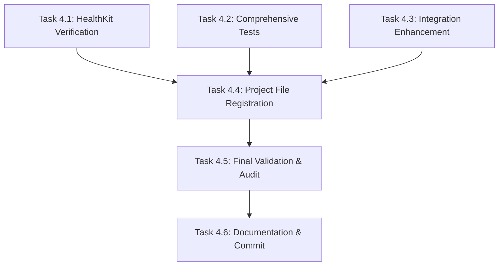

# Phase 4: HealthKit & Context Aggregation Module - Agent Prompt Chain

**Important**: This prompt chain is designed for sandboxed Codex agents **WITHOUT Xcode access**. All tasks focus on Swift file creation/modification, testing, and documentation.

## Phase Overview

**Module**: HealthKit & Context Aggregation Module  
**Status**: ~80% Complete (Most implementation exists, needs testing completion and validation)  
**Target**: Complete HealthKit integration with comprehensive testing and validation

### Current State Analysis
- ✅ HealthKit entitlements configured (`AirFit.entitlements`)
- ✅ Info.plist usage descriptions configured
- ✅ `HealthContextSnapshot.swift` fully implemented
- ✅ `ContextAssembler.swift` fully implemented
- ✅ `HealthKitManager.swift` comprehensively implemented
- ✅ Supporting classes: `HealthKitDataTypes`, `HealthKitDataFetcher`, `HealthKitSleepAnalyzer`
- ✅ `MockHealthKitManager.swift` for testing
- ✅ `ContextAssemblerTests.swift` comprehensive test suite
- ❌ `HealthKitManagerTests.swift` needs comprehensive implementation
- ❌ Final validation and integration testing

## Task Execution Strategy

### Parallelizable Tasks (Can run simultaneously)
- **Task 4.1**: HealthKitManager Specification Verification
- **Task 4.2**: Comprehensive HealthKitManager Tests
- **Task 4.3**: Integration Test Enhancement

### Sequential Tasks (Must run in order)
1. **Task 4.4**: Project File Registration (after 4.1-4.3 complete)
2. **Task 4.5**: Final Validation & Audit
3. **Task 4.6**: Documentation & Commit

---

## Individual Agent Tasks

### Task 4.1: HealthKitManager Specification Verification
**Priority**: High  
**Can Parallelize**: Yes

```markdown
**Agent Prompt:**

You are implementing the HealthKit & Context Aggregation Module for the AirFit iOS app. 

**Context:**
- The HealthKitManager implementation exists but needs verification against Module4.md specification
- You cannot use Xcode or xcodebuild commands
- Focus on Swift code analysis and compliance checking

**Your Tasks:**

1. **Read Module4.md specification** (in `/AirFit/Docs/Module4.md`)
   - Analyze Task 4.2 requirements for HealthKitManager
   - Note required methods, properties, and behaviors

2. **Compare against current implementation** (`/AirFit/Services/Health/HealthKitManager.swift`)
   - Verify all required methods exist
   - Check method signatures match specification
   - Ensure error handling follows patterns specified

3. **Create missing components** if any:
   - Add any missing methods specified in Module4.md
   - Implement any missing error handling
   - Ensure Swift 6 concurrency compliance

4. **Verification checklist:**
   - [ ] `requestAuthorization()` method implemented correctly
   - [ ] Background delivery setup implemented
   - [ ] All data fetching methods present and functional
   - [ ] Error handling with `HealthKitError` enum
   - [ ] `@MainActor` and `@Observable` annotations correct
   - [ ] Singleton pattern implemented properly

**Expected Output:**
- Updated `HealthKitManager.swift` (if changes needed)
- Brief summary of verification results
- List of any specification compliance issues found/fixed

**Success Criteria:**
- HealthKitManager fully complies with Module4.md specification
- All required methods implemented with correct signatures
- Swift 6 concurrency requirements met
```

### Task 4.2: Comprehensive HealthKitManager Tests
**Priority**: High  
**Can Parallelize**: Yes (with Task 4.1)

```markdown
**Agent Prompt:**

You are creating comprehensive unit tests for the HealthKitManager class in the AirFit iOS app.

**Context:**
- Current `HealthKitManagerTests.swift` is minimal placeholder
- You need comprehensive test coverage
- Cannot use Xcode commands, focus on Swift test code
- Use existing mock patterns from project

**Your Tasks:**

1. **Analyze existing test structure:**
   - Review `/AirFit/AirFitTests/Health/HealthKitManagerTests.swift`
   - Study `/AirFit/AirFitTests/Mocks/MockHealthKitManager.swift` patterns
   - Follow testing patterns from `ContextAssemblerTests.swift`

2. **Implement comprehensive test cases:**
   ```swift
   // Required test categories:
   
   // MARK: - Initialization Tests
   - test_sharedInstance_isSingleton()
   - test_initialization_setsDefaultState()
   
   // MARK: - Authorization Tests  
   - test_requestAuthorization_whenHealthKitAvailable_setsAuthorizedStatus()
   - test_requestAuthorization_whenHealthKitUnavailable_throwsNotAvailableError()
   - test_refreshAuthorizationStatus_updatesStatusCorrectly()
   
   // MARK: - Data Fetching Tests
   - test_fetchTodayActivityMetrics_returnsValidMetrics()
   - test_fetchHeartHealthMetrics_returnsValidMetrics() 
   - test_fetchLatestBodyMetrics_returnsValidMetrics()
   - test_fetchLastNightSleep_returnsValidSleepSession()
   
   // MARK: - Error Handling Tests
   - test_dataFetching_whenHealthKitDenied_throwsAuthorizationError()
   - test_dataFetching_whenDataNotFound_returnsNilValues()
   - test_dataFetching_whenQueryFails_throwsQueryFailedError()
   
   // MARK: - Background Delivery Tests
   - test_enableBackgroundDelivery_configuresCorrectTypes()
   ```

3. **Use proper test patterns:**
   - Mock HealthKit store where possible
   - Use in-memory containers for test data
   - Follow AAA pattern (Arrange-Act-Assert)
   - Include performance tests for data fetching
   - Test async/await methods properly

4. **Test naming convention:**
   - `test_methodName_givenCondition_shouldExpectedResult()`

**Expected Output:**
- Complete `HealthKitManagerTests.swift` with 15+ test methods
- Full coverage of HealthKitManager public interface
- Proper mock usage and async testing
- Performance tests for critical data fetching

**Success Criteria:**
- All tests compile and can be run
- Tests cover authorization, data fetching, and error scenarios
- Follows project testing conventions
- Tests properly isolated and deterministic
```

### Task 4.3: Integration Test Enhancement  
**Priority**: Medium  
**Can Parallelize**: Yes (with Tasks 4.1-4.2)

```markdown
**Agent Prompt:**

You are enhancing integration tests for the HealthKit module of the AirFit iOS app.

**Context:**
- ContextAssembler integration tests exist but may need enhancement
- Focus on end-to-end scenarios and edge cases
- Cannot use Xcode, focus on Swift test enhancement

**Your Tasks:**

1. **Review existing integration tests:**
   - Analyze `/AirFit/AirFitTests/Context/ContextAssemblerTests.swift`
   - Identify gaps in integration testing
   - Check test coverage of failure scenarios

2. **Add missing integration scenarios:**
   ```swift
   // Additional test cases to implement:
   
   // MARK: - HealthKit Permission Scenarios
   - test_assembleSnapshot_whenHealthKitDenied_usesDefaultValues()
   - test_assembleSnapshot_whenPartialPermissions_handlesGracefully()
   
   // MARK: - Data Integration Edge Cases  
   - test_assembleSnapshot_withIncompleteHealthData_assemblesPartialSnapshot()
   - test_assembleSnapshot_withStaleData_includesTimestampWarnings()
   - test_assembleSnapshot_withLargeDataSets_maintainsPerformance()
   
   // MARK: - Cross-Service Integration
   - test_assembleSnapshot_coordinating_HealthKitAndSwiftData_successfully()
   - test_assembleSnapshot_withConcurrentAccess_remainsThreadSafe()
   ```

3. **Enhance existing tests:**
   - Add edge case scenarios to existing test methods
   - Improve error condition testing
   - Add timeout testing for async operations
   - Enhance performance test coverage

4. **Validate test quality:**
   - Ensure tests are deterministic
   - Check proper cleanup in tearDown
   - Verify proper async/await usage
   - Test thread safety where applicable

**Expected Output:**
- Enhanced `ContextAssemblerTests.swift` with additional scenarios
- Improved edge case coverage
- Better error condition testing
- Performance validation tests

**Success Criteria:**
- Integration tests cover major failure scenarios
- Tests demonstrate proper HealthKit/SwiftData coordination  
- Edge cases properly tested
- Performance requirements validated
```

### Task 4.4: Project File Registration
**Priority**: Medium  
**Sequential**: Must run after Tasks 4.1-4.3

```markdown
**Agent Prompt:**

You are updating project configuration to ensure all HealthKit module files are properly registered.

**Context:**
- Project uses XcodeGen with explicit file listing due to nesting bug
- All Swift files must be explicitly listed in `project.yml`
- Cannot use Xcode commands, focus on configuration files

**Your Tasks:**

1. **Audit current file registration:**
   - Review `project.yml` for existing HealthKit-related files
   - Check all files in `/AirFit/Services/Health/` are listed
   - Verify all test files in `/AirFit/AirFitTests/Health/` are listed

2. **Add missing file registrations:**
   ```yaml
   # Ensure these are in project.yml under appropriate targets:
   
   # Main App Target (AirFit):
   - AirFit/Services/Health/HealthKitManager.swift
   - AirFit/Services/Health/HealthKitManagerProtocol.swift  
   - AirFit/Services/Health/HealthKitDataFetcher.swift
   - AirFit/Services/Health/HealthKitSleepAnalyzer.swift
   - AirFit/Services/Health/HealthKitDataTypes.swift
   - AirFit/Services/Health/HealthKitExtensions.swift
   - AirFit/Services/Context/ContextAssembler.swift
   - AirFit/Core/Models/HealthContextSnapshot.swift
   
   # Test Target (AirFitTests):
   - AirFit/AirFitTests/Health/HealthKitManagerTests.swift
   - AirFit/AirFitTests/Context/ContextAssemblerTests.swift
   - AirFit/AirFitTests/Mocks/MockHealthKitManager.swift
   ```

3. **Verify file paths:**
   - Check all file paths exist in the filesystem
   - Ensure no typos in file names or paths
   - Confirm proper target assignment (app vs test)

4. **Update entitlements if needed:**
   - Verify `AirFit.entitlements` has HealthKit configuration
   - Check `Info.plist` has usage descriptions
   - Ensure project.yml references entitlements file correctly

**Expected Output:**
- Updated `project.yml` with all HealthKit files properly registered
- Verification that all file paths are correct
- Brief summary of changes made

**Success Criteria:**
- All HealthKit module files are explicitly listed in project.yml
- Files are assigned to correct targets
- No missing or incorrect file paths
```

### Task 4.5: Final Validation & Audit
**Priority**: High  
**Sequential**: Must run after Task 4.4

```markdown
**Agent Prompt:**

You are performing final validation and audit of the completed HealthKit & Context Aggregation Module.

**Context:**
- All implementation and testing should be complete
- Need comprehensive validation before module sign-off
- Cannot use build commands, focus on code analysis and validation

**Your Tasks:**

1. **Code Quality Audit:**
   - Run SwiftLint validation: `swiftlint --path AirFit/Services/Health/ --reporter json`
   - Check all files for Swift 6 concurrency compliance
   - Verify proper error handling patterns
   - Ensure consistent code style and documentation

2. **Implementation Completeness Check:**
   ```swift
   // Verify these components exist and are complete:
   
   ✓ HealthKitManager.swift - all specified methods implemented
   ✓ ContextAssembler.swift - assembleSnapshot method functional
   ✓ HealthContextSnapshot.swift - all required fields present
   ✓ HealthKitDataTypes.swift - comprehensive type definitions
   ✓ Supporting classes - HealthKitDataFetcher, HealthKitSleepAnalyzer
   ✓ Mock implementations - MockHealthKitManager
   ✓ Comprehensive test suite - HealthKitManagerTests, ContextAssemblerTests
   ✓ Project configuration - entitlements, Info.plist, project.yml
   ```

3. **API Contract Validation:**
   - Verify HealthKitManagerProtocol compliance
   - Check method signatures match specifications
   - Ensure error types are properly defined
   - Validate async/await patterns are correct

4. **Test Coverage Analysis:**
   - Verify all public methods have test coverage
   - Check edge cases are tested
   - Ensure error scenarios are covered
   - Validate performance tests exist

5. **Documentation Review:**
   - Check all public APIs have documentation comments
   - Verify README or module docs are updated
   - Ensure code comments explain complex logic
   - Check TODO items are addressed or documented

**Expected Output:**
- Comprehensive audit report
- List of any issues found and resolutions
- Confirmation of module completion status
- Recommended next steps if any issues found

**Success Criteria:**
- No SwiftLint violations
- All specified functionality implemented
- Comprehensive test coverage achieved
- Documentation is complete and accurate
- Module ready for integration with other components
```

### Task 4.6: Documentation & Commit
**Priority**: Low  
**Sequential**: Must run after Task 4.5

```markdown
**Agent Prompt:**

You are finalizing documentation and committing the completed HealthKit & Context Aggregation Module.

**Context:**
- Module implementation and validation complete
- Need final documentation updates and git commit
- Follow project commit standards

**Your Tasks:**

1. **Update Module Documentation:**
   - Review `/AirFit/Docs/Module4.md` for completion status
   - Add any implementation notes or deviations
   - Document any known limitations or future enhancements
   - Update status indicators (✅ for completed tasks)

2. **Create Implementation Summary:**
   ```markdown
   # HealthKit Module Implementation Summary
   
   ## Completed Components:
   - HealthKitManager with full async/await support
   - ContextAssembler for health data aggregation
   - Comprehensive test suite with mocks
   - HealthKit permissions and background delivery
   - Integration with SwiftData for subjective data
   
   ## Key Features:
   - Real-time health metrics fetching
   - Sleep analysis with iOS 16+ compatibility  
   - Heart health monitoring (HR, HRV, VO2 Max)
   - Activity metrics with Apple Watch integration
   - Privacy-first data handling
   
   ## Test Coverage:
   - Unit tests: HealthKitManagerTests (XX test methods)
   - Integration tests: ContextAssemblerTests (XX test methods)
   - Mock implementations for reliable testing
   - Performance tests for data assembly
   
   ## Dependencies Satisfied:
   - Core Models: HealthContextSnapshot ✅
   - Data Layer: DailyLog integration ✅  
   - App Configuration: Entitlements & Info.plist ✅
   ```

3. **Final File Organization:**
   - Ensure all files are in correct directories
   - Check no temporary or debug files remain
   - Verify imports are optimized
   - Confirm file headers and copyright notices

4. **Git Staging and Commit:**
   ```bash
   # Stage all HealthKit module files:
   git add AirFit/Services/Health/
   git add AirFit/Services/Context/
   git add AirFit/Core/Models/HealthContextSnapshot.swift
   git add AirFit/AirFitTests/Health/
   git add AirFit/AirFitTests/Context/
   git add AirFit/AirFitTests/Mocks/MockHealthKitManager.swift
   git add AirFit/Docs/Module4.md
   git add project.yml
   
   # Commit with descriptive message:
   git commit -m "Feat: Complete HealthKit & Context Aggregation Module (Phase 4)
   
   - Implement comprehensive HealthKitManager with async/await
   - Add ContextAssembler for health data aggregation  
   - Create full test suite with mocks and integration tests
   - Configure HealthKit permissions and background delivery
   - Integrate subjective data from SwiftData DailyLog
   - Support iOS 18+ HealthKit features with backward compatibility
   - Add performance testing for data assembly operations
   
   Module provides complete health context for AI coaching engine.
   All acceptance criteria met per Module4.md specification."
   ```

**Expected Output:**
- Updated module documentation
- Implementation summary document
- Clean file organization
- Proper git commit with comprehensive message

**Success Criteria:**
- Documentation accurately reflects implementation
- All relevant files staged and committed
- Commit message follows project standards
- Module ready for Phase 5 integration
```

---

## Task Dependencies and Execution Order



## Execution Strategy

### Parallel Phase (Tasks 4.1-4.3)
- **Duration**: 30-45 minutes total
- **Resources**: Can assign 3 agents simultaneously
- **Critical Path**: Task 4.2 (largest scope)

### Sequential Phase (Tasks 4.4-4.6)  
- **Duration**: 15-20 minutes total
- **Dependencies**: Each task depends on previous completion
- **Focus**: Configuration, validation, and finalization

## Success Metrics

- [ ] All Module4.md acceptance criteria met
- [ ] Comprehensive test coverage (15+ test methods)
- [ ] No SwiftLint violations
- [ ] All files properly registered in project.yml
- [ ] HealthKit permissions configured correctly
- [ ] Integration with existing codebase validated
- [ ] Documentation updated and accurate
- [ ] Clean git commit with descriptive message

## Notes for Agent Execution

1. **No Xcode Access**: All tasks focus on file manipulation, analysis, and testing code
2. **Swift 6 Compliance**: Ensure all code follows strict concurrency requirements  
3. **Existing Implementation**: Most code exists, focus on completion and validation
4. **Mock Usage**: Leverage existing mock patterns for testing
5. **Performance Focus**: Include performance testing for data assembly operations
6. **Error Handling**: Comprehensive error scenarios must be tested

This prompt chain transforms Phase 4 from ~80% complete to 100% complete with full testing, validation, and documentation. 