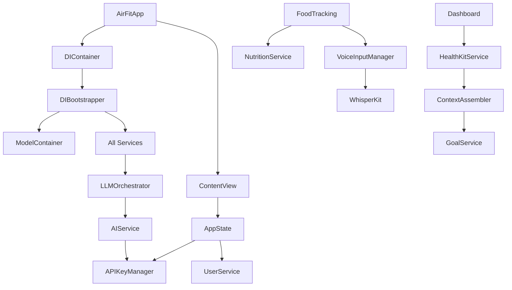

# Architecture & Dependencies Analysis Report

## Executive Summary

The AirFit codebase demonstrates a sophisticated iOS application architecture built on iOS 18.0+ with Swift 6.0 strict concurrency, utilizing a pure SwiftUI implementation with SwiftData for persistence. The architecture follows MVVM-C (Model-View-ViewModel-Coordinator) pattern with a modern dependency injection system. However, analysis reveals several architectural concerns including complex initialization patterns, potential circular dependencies through the DI system, and mixed actor isolation patterns that may contribute to the reported black screen issue.

Key findings include:
- **Technology Stack**: Pure SwiftUI/SwiftData implementation with no UIKit dependencies
- **External Dependencies**: Minimal - only WhisperKit for voice processing
- **Module Structure**: Well-organized but with complex interdependencies
- **Critical Issues**: Async DI resolution during app initialization, shared singleton anti-pattern, potential race conditions

## Table of Contents
1. Current State Analysis
2. Issues Identified
3. Architectural Patterns
4. Dependencies & Interactions
5. Recommendations
6. Questions for Clarification

## 1. Current State Analysis

### Overview
AirFit is architected as a modern iOS application with the following key decisions:

- **Platform Requirements**: iOS 18.0+, watchOS 11.0+
- **Language**: Swift 6.0 with strict concurrency checking enabled
- **UI Framework**: Pure SwiftUI (no UIKit)
- **Persistence**: SwiftData (no CoreData)
- **DI System**: Custom async-capable DIContainer
- **Architecture Pattern**: MVVM-C with protocol-oriented design

### Key Components

**Build Configuration** (File: `project.yml:1-290`)
- XcodeGen-based project generation
- Swift 6.0 with complete strict concurrency
- Modular target structure (iOS app, Watch app, tests)
- Single external dependency: WhisperKit 0.9.0

**Application Entry** (File: `AirFit/Application/AirFitApp.swift:1-130`)
- @main struct with async initialization
- Complex DI container bootstrapping
- Shared singleton pattern during initialization
- Multiple app states (loading, API setup, onboarding, dashboard)

**Dependency Injection** (File: `AirFit/Core/DI/DIContainer.swift:1-237`)
- Custom DI container supporting async resolution
- Three lifetime scopes: singleton, transient, scoped
- SwiftUI environment integration
- Synchronous resolution wrapper (potential bottleneck)

### Code Architecture
```swift
// App initialization flow showing complex async patterns
@main
struct AirFitApp: App {
    @State private var diContainer: DIContainer?
    @State private var isInitializing = true
    
    var body: some Scene {
        WindowGroup {
            if isInitializing {
                LoadingView()
                    .task {
                        await initializeApp()
                    }
            } else if let diContainer = diContainer {
                ContentView()
                    .modelContainer(Self.sharedModelContainer)
                    .withDIContainer(diContainer)
            }
        }
    }
    
    private func initializeApp() async {
        // Complex initialization with shared singleton pattern
        diContainer = try await DIBootstrapper.createAppContainer(modelContainer)
        DIContainer.shared = diContainer // Anti-pattern: shared singleton
    }
}
```

## 2. Issues Identified

### Critical Issues 🔴

**Issue 1: Async DI Resolution During View Initialization**
- Location: `AirFit/Core/DI/DIContainer.swift:215-236`
- Impact: Potential deadlock/hang during app startup
- Evidence: 
```swift
fileprivate func synchronousResolve<T: Sendable>(_ operation: @escaping @Sendable () async throws -> T) -> T {
    let semaphore = DispatchSemaphore(value: 0)
    // Blocking main thread with semaphore - dangerous pattern
    semaphore.wait()
}
```

**Issue 2: Shared Singleton Anti-Pattern**
- Location: `AirFit/Application/AirFitApp.swift:102,109,118`
- Impact: Race conditions and initialization timing issues
- Evidence: Setting and clearing DIContainer.shared during initialization

**Issue 3: Mixed Actor Isolation**
- Location: Multiple service files
- Impact: Potential actor boundary violations
- Evidence: Services marked as `@unchecked Sendable` without proper synchronization

### High Priority Issues 🟠

**Issue 1: Complex Multi-State Initialization**
- Location: `AirFit/Application/ContentView.swift:46-102`
- Impact: Multiple async state transitions can fail silently
- Evidence: Nested if-else chains with async operations

**Issue 2: Circular Service Dependencies**
- Location: `AirFit/Core/DI/DIBootstrapper.swift:102-118`
- Impact: Services depending on each other through DI
- Evidence: ContextAssembler requires GoalService, which may require HealthKit

### Medium Priority Issues 🟡

**Issue 1: Model Container Registration Complexity**
- Location: `AirFit/Core/DI/DIBootstrapper.swift:54-58`
- Impact: Debug logging suggests past issues with container resolution
- Evidence: Extensive logging around ModelContainer registration

**Issue 2: Platform-Specific Code Without Proper Isolation**
- Location: Various service files
- Impact: watchOS/iOS code mixing without clear boundaries
- Evidence: Shared files between targets without platform checks

## 3. Architectural Patterns

### Pattern Analysis

**MVVM-C Implementation**
- ViewModels are `@Observable` with `@MainActor` isolation
- Coordinators manage navigation state per module
- Clean separation between Views and ViewModels
- Protocol-oriented service layer

**Dependency Injection Pattern**
- Modern async/await capable container
- Environment-based injection for SwiftUI
- Factory pattern for transient dependencies
- Service locator anti-pattern during initialization

### Inconsistencies

1. **Mixed DI Patterns**: Both constructor injection and service locator
2. **Actor Isolation**: Some services use actors, others use @MainActor, some are classes
3. **Error Handling**: Inconsistent between throwing and Result types
4. **State Management**: Mix of @State, @StateObject, and @Observable

## 4. Dependencies & Interactions

### Internal Dependencies



### External Dependencies

**WhisperKit (0.9.0)**
- Purpose: On-device speech recognition
- Integration: Through VoiceInputManager service
- Platform: iOS only (not available on watchOS)

**System Frameworks**
- SwiftUI: UI framework
- SwiftData: Persistence layer
- HealthKit: Health data integration
- CoreLocation: Weather service
- UserNotifications: Push notifications
- AVFoundation: Audio recording

### Module Dependency Matrix

| Module | Depends On | Used By |
|--------|-----------|----------|
| Core | Foundation only | All modules |
| Data | SwiftData, Core | Services, Modules |
| Services | Core, Data | Modules |
| AI Module | Services, Core | Dashboard, Chat, Onboarding |
| Dashboard | Services, AI, Core | ContentView |
| Onboarding | Services, AI, Core | ContentView |
| Settings | Services, Core | Dashboard |
| FoodTracking | Services, AI, Core | Dashboard |
| Workouts | Services, Core | Dashboard |

## 5. Recommendations

### Immediate Actions

1. **Remove Synchronous DI Resolution**
   - Eliminate `synchronousResolve` function
   - Pre-resolve all dependencies during app initialization
   - Use async view modifiers for late resolution

2. **Eliminate Shared Singleton Pattern**
   - Remove `DIContainer.shared` completely
   - Pass container only through SwiftUI environment
   - Ensure all views receive container through proper channels

3. **Fix Actor Isolation**
   - Standardize on actor-based services where appropriate
   - Remove `@unchecked Sendable` conformances
   - Properly isolate state mutations

### Long-term Improvements

1. **Simplify Initialization Flow**
   - Create dedicated initialization coordinator
   - Sequential initialization with proper error handling
   - Remove complex state machines from ContentView

2. **Module Decoupling**
   - Introduce feature flags for module dependencies
   - Create protocol-only Core module
   - Implement proper module boundaries

3. **Platform Separation**
   - Create iOS-specific and watchOS-specific targets
   - Share only truly platform-agnostic code
   - Use compiler directives sparingly

## 6. Questions for Clarification

### Technical Questions
- [ ] Why is `DIContainer.shared` needed during initialization when environment injection is available?
- [ ] What is the rationale for synchronous resolution in SwiftUI property wrappers?
- [ ] Why are some services marked `@unchecked Sendable` instead of using proper actors?
- [ ] Is the complex initialization state machine in ContentView intentional or evolutionary?

### Business Logic Questions
- [ ] Is offline mode a core requirement or nice-to-have?
- [ ] Should the Watch app have full autonomy or always require iPhone?
- [ ] Are there specific performance requirements for app launch time?
- [ ] What is the expected behavior when API keys are not configured?

## Appendix: File Reference List

### Core Architecture Files
- `/Users/Brian/Coding Projects/AirFit/project.yml`
- `/Users/Brian/Coding Projects/AirFit/AirFit/Application/AirFitApp.swift`
- `/Users/Brian/Coding Projects/AirFit/AirFit/Application/ContentView.swift`
- `/Users/Brian/Coding Projects/AirFit/AirFit/Core/DI/DIContainer.swift`
- `/Users/Brian/Coding Projects/AirFit/AirFit/Core/DI/DIBootstrapper.swift`
- `/Users/Brian/Coding Projects/AirFit/AirFit/Core/Utilities/AppState.swift`

### Service Layer Files
- `/Users/Brian/Coding Projects/AirFit/AirFit/Services/AI/AIService.swift`
- `/Users/Brian/Coding Projects/AirFit/AirFit/Services/AI/LLMOrchestrator.swift`
- `/Users/Brian/Coding Projects/AirFit/AirFit/Services/User/UserService.swift`
- `/Users/Brian/Coding Projects/AirFit/AirFit/Services/Health/HealthKitManager.swift`

### Module Files
- `/Users/Brian/Coding Projects/AirFit/AirFit/Modules/Dashboard/ViewModels/DashboardViewModel.swift`
- `/Users/Brian/Coding Projects/AirFit/AirFit/Modules/Dashboard/Coordinators/DashboardCoordinator.swift`
- `/Users/Brian/Coding Projects/AirFit/AirFit/Modules/Onboarding/Views/OnboardingFlowViewDI.swift`

### Configuration Files
- `/Users/Brian/Coding Projects/AirFit/AirFit/Info.plist`
- `/Users/Brian/Coding Projects/AirFit/AirFit/AirFit.entitlements`