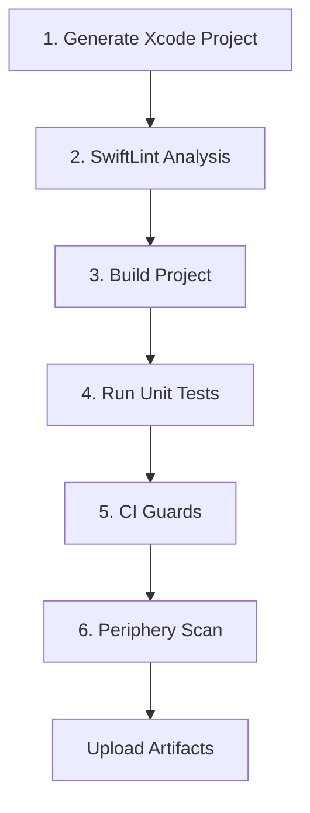

# AirFit CI Pipeline Documentation

## Overview

The AirFit CI pipeline is a comprehensive continuous integration system designed to ensure code quality, prevent regressions, and maintain high standards across the codebase. The pipeline runs automatically on pushes to `main` and `develop` branches, as well as on all pull requests.

## Pipeline Architecture

### Workflow Files

- **`.github/workflows/ci.yml`** - Main comprehensive CI pipeline
- **`.github/workflows/test.yml`** - Legacy test-focused workflow (kept for compatibility)

### Pipeline Stages

The CI pipeline consists of six main stages, executed in sequence:



## Stage Details

### 1. Generate Xcode Project
- **Tool**: XcodeGen
- **Purpose**: Generate `AirFit.xcodeproj` from `project.yml`
- **Local Command**: `xcodegen generate`

### 2. SwiftLint Analysis
- **Tool**: SwiftLint
- **Purpose**: Enforce code style and catch common issues
- **Configuration**: `AirFit/.swiftlint.yml`
- **Local Command**: `swiftlint --strict`

### 3. Build Project
- **Tool**: xcodebuild
- **Purpose**: Ensure code compiles without errors
- **Targets**: AirFit (iOS), AirFitWatchApp (watchOS)
- **Local Commands**:
  ```bash
  # iOS App
  xcodebuild build \
    -scheme AirFit \
    -destination 'platform=iOS Simulator,name=iPhone 16 Pro,OS=26.0' \
    -configuration Debug
    
  # Watch App  
  xcodebuild build \
    -scheme AirFitWatchApp \
    -destination 'platform=watchOS Simulator,name=Apple Watch Series 10 (46mm),OS=11.0' \
    -configuration Debug
  ```

### 4. Run Unit Tests
- **Tool**: xcodebuild + XCTest
- **Purpose**: Execute automated tests and generate coverage reports
- **Test Plan**: `AirFit.xctestplan`
- **Coverage**: Enabled for main targets
- **Local Commands**:
  ```bash
  # Unit Tests
  xcodebuild test \
    -scheme AirFit \
    -destination 'platform=iOS Simulator,name=iPhone 16 Pro,OS=26.0' \
    -testPlan AirFit \
    -only-testing:AirFitTests \
    -enableCodeCoverage YES
    
  # UI Tests
  xcodebuild test \
    -scheme AirFit \
    -destination 'platform=iOS Simulator,name=iPhone 16 Pro,OS=26.0' \
    -testPlan AirFit \
    -only-testing:AirFitUITests
  ```

### 5. CI Quality Guards
- **Tool**: Custom script (`Scripts/ci-guards.sh`)
- **Purpose**: Comprehensive code quality analysis
- **Status**: Currently in monitoring mode (failures logged but don't fail CI)
- **Local Command**: `./Scripts/ci-guards.sh`

#### Guard Categories:
1. **File Size**: Files over 1,000 lines
2. **Function Size**: Functions over 50 lines
3. **TODO/FIXME**: Unresolved development comments
4. **Debug Statements**: `print()`, `debugPrint()`, `NSLog()` calls
5. **Force Unwrapping**: Unsafe `!` operators
6. **Hardcoded Strings**: Potential localization issues
7. **Access Control**: Missing visibility modifiers
8. **Type Size**: Classes/structs over 300 lines
9. **Error Handling**: Unsafe `try!` statements

### 6. Periphery Scan
- **Tool**: Periphery
- **Purpose**: Dead code detection
- **Output**: JSON and XML reports
- **Status**: Report-only (doesn't fail CI)
- **Local Command**: 
  ```bash
  periphery scan \
    --project AirFit.xcodeproj \
    --schemes AirFit,AirFitWatchApp \
    --targets AirFit,AirFitWatchApp
  ```

## Caching Strategy

### Swift Package Manager Dependencies
- **Path**: `~/Library/Caches/org.swift.swiftpm`, `~/Library/org.swift.swiftpm`, `.build`
- **Key**: OS + project.yml + Package.resolved hashes
- **Benefits**: Faster dependency resolution

### Build Artifacts (Selective)
- **Path**: `~/Library/Developer/Xcode/DerivedData/ModuleCache.noindex`
- **Key**: OS + project.yml + Swift files hashes
- **Safety**: Only caches module cache and intermediates, not final builds

## Artifacts Generated

### Test Results
- **File**: `TestResults/unit-tests.xcresult`, `TestResults/ui-tests.xcresult`
- **Contains**: Test outcomes, performance metrics, crash logs
- **Retention**: 30 days

### Coverage Report
- **Files**: `coverage.json`, `coverage-report.txt`
- **Contains**: Line and function coverage metrics
- **Upload**: Also sent to Codecov

### Periphery Report
- **Files**: `periphery-report.json`, `periphery-report.xml`
- **Contains**: Unused code analysis
- **Usage**: Code cleanup guidance

### CI Guards Report
- **Files**: `ci-guards-violations.txt`, `ci-guards-summary.json`
- **Contains**: Quality violations and metrics
- **Usage**: Code quality monitoring

## Test Matrix (PR Only)

For pull requests, an additional job runs tests across multiple device configurations:
- iPhone 16 Pro (device validation, iOS 26.0)
- CI runs iOS 26.0 simulator targets

## Running Locally

### Prerequisites
```bash
# Install required tools
brew install xcodegen swiftlint peripheryapp/periphery/periphery

# Optional: Install xcpretty for prettier output
gem install xcpretty
```

### Full Pipeline Simulation
```bash
# 1. Generate project
xcodegen generate

# 2. Lint code
swiftlint --strict

# 3. Build
xcodebuild build \
  -scheme AirFit \
  -destination 'platform=iOS Simulator,name=iPhone 16 Pro,OS=26.0' \
  -configuration Debug

# 4. Test
xcodebuild test \
  -scheme AirFit \
  -destination 'platform=iOS Simulator,name=iPhone 16 Pro,OS=26.0' \
  -testPlan AirFit \
  -enableCodeCoverage YES

# 5. Quality guards
./Scripts/ci-guards.sh

# 6. Dead code analysis
periphery scan --project AirFit.xcodeproj --schemes AirFit,AirFitWatchApp
```

### Quick Verification
```bash
# Essential checks only
xcodegen generate && \
swiftlint --strict && \
xcodebuild build -scheme AirFit -destination 'platform=iOS Simulator,name=iPhone 16 Pro,OS=26.0'
```

## Interpreting Results

### ✅ Success Indicators
- All builds pass without errors or warnings
- SwiftLint shows no violations
- Unit tests achieve >80% coverage
- UI tests pass (or have documented flaky test exceptions)

### ⚠️ Warning Indicators
- CI Guards report quality violations (currently monitoring only)
- Periphery finds unused code
- Test coverage below target threshold
- UI tests are flaky

### ❌ Failure Indicators
- Build failures
- SwiftLint violations in strict mode
- Unit test failures
- Critical quality guard violations (when enforcement enabled)

## Troubleshooting Guide

### Common Issues

#### Build Failures
**Symptom**: xcodebuild fails with compilation errors
**Solutions**:
1. Check if project.yml is valid: `xcodegen generate`
2. Verify Swift syntax: Run locally first
3. Check for missing dependencies or imports
4. Ensure Xcode version compatibility

#### SwiftLint Violations
**Symptom**: SwiftLint --strict fails
**Solutions**:
1. Run `swiftlint autocorrect` for auto-fixable issues
2. Review `.swiftlint.yml` configuration
3. Add `// swiftlint:disable rule_name` for exceptions
4. Check for trailing whitespace or formatting issues

#### Test Failures
**Symptom**: Unit or UI tests fail
**Solutions**:
1. Run tests locally: `xcodebuild test -scheme AirFit`
2. Check for environment-specific issues
3. Verify test data and mocks
4. Check for timing or async issues

#### Cache Issues
**Symptom**: Builds are slow or behave unexpectedly
**Solutions**:
1. Clear derived data: `rm -rf ~/Library/Developer/Xcode/DerivedData`
2. Reset SPM cache: `rm -rf ~/Library/Caches/org.swift.swiftpm`
3. Clean build folder in Xcode
4. Invalidate CI cache by updating cache key

#### Periphery False Positives
**Symptom**: Periphery reports used code as unused
**Solutions**:
1. Check for dynamic usage (reflection, Objective-C runtime)
2. Add `// periphery:ignore` comments
3. Verify protocol conformances and interface requirements
4. Check for code used only in specific build configurations

### Performance Issues

#### Slow Builds
1. Check cache hit rates in CI logs
2. Verify SPM dependency caching is working
3. Consider breaking up large files flagged by CI guards
4. Review incremental build settings

#### Test Timeouts
1. Check test timeout settings in `AirFit.xctestplan`
2. Review async test patterns
3. Consider test parallelization settings
4. Check for resource contention in CI environment

## Configuration Files

### Key Configuration Files
- `project.yml` - Xcode project generation
- `AirFit/.swiftlint.yml` - SwiftLint rules
- `AirFit.xctestplan` - Test configuration
- `Scripts/ci-guards.sh` - Quality guards
- `.github/workflows/ci.yml` - CI pipeline definition

### Customization Options

#### SwiftLint Rules
Edit `AirFit/.swiftlint.yml`:
```yaml
# Disable rules
disabled_rules:
  - line_length

# Enable additional rules
opt_in_rules:
  - force_unwrapping

# Configure rule parameters
line_length:
  warning: 120
  error: 200
```

#### CI Guards Thresholds
Edit `Scripts/ci-guards.sh`:
```bash
MAX_FILE_SIZE=1000     # lines
MAX_FUNCTION_SIZE=50   # lines
MAX_TYPE_SIZE=300      # lines
```

#### Test Configuration
Edit `AirFit.xctestplan`:
```json
{
  "defaultOptions": {
    "maximumTestExecutionTimeAllowance": 600,
    "testTimeoutsEnabled": true
  }
}
```

## Monitoring and Metrics

### Key Metrics Tracked
- Build duration
- Test execution time
- Code coverage percentage
- SwiftLint violation trends
- CI guard violation counts
- Periphery unused code metrics

### PR Comments
The CI system automatically comments on pull requests with:
- Test results summary
- Coverage metrics
- Quality analysis results
- Links to detailed artifacts

### Artifacts Dashboard
All artifacts are available in the GitHub Actions interface:
1. Go to repository Actions tab
2. Select the specific workflow run
3. Scroll to Artifacts section
4. Download reports for detailed analysis

## Future Enhancements

### Planned Improvements
1. **Enforce CI Guards**: Move from monitoring to enforcement mode
2. **Performance Benchmarks**: Add performance regression detection
3. **Security Scanning**: Integrate security vulnerability detection
4. **Dependency Auditing**: Monitor for outdated or vulnerable dependencies
5. **Code Climate Integration**: Advanced code quality metrics
6. **Fastlane Integration**: Streamlined build and deployment processes

### Integration Opportunities
- Slack notifications for failed builds
- JIRA integration for tracking quality debt
- Automated PR updates based on quality metrics
- Integration with code review tools

---

*This documentation is maintained alongside the CI pipeline. For updates or questions, please refer to the development team.*
