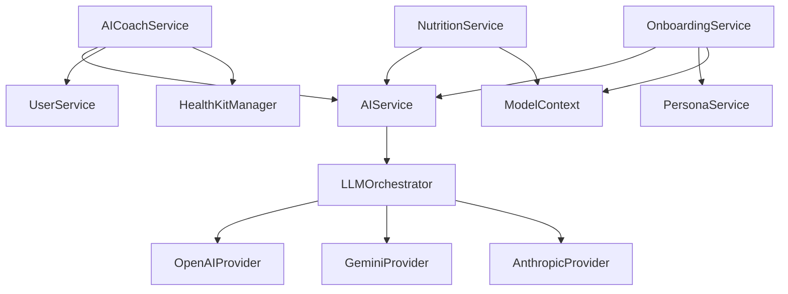

# Service Layer Architecture Catalog Analysis Report

## Executive Summary

This comprehensive analysis catalogs all 50+ services in the AirFit application, revealing a complex service architecture with significant inconsistencies that likely contribute to the app's initialization issues. The service layer shows mixed patterns of actor isolation, inconsistent protocol conformance, and problematic dependency management. Only 2 out of 20+ main services properly implement the base `ServiceProtocol`, creating lifecycle management challenges. The analysis identifies critical architectural issues including mixed concurrency patterns, singleton abuse, and lack of unified error handling that must be addressed to resolve the black screen initialization problem.

The service layer demonstrates sophisticated functionality across AI integration, health tracking, and user management, but the architectural inconsistencies create significant technical debt and initialization complexity.

## Table of Contents
1. Service Inventory
2. Service Categories
3. Service Patterns
4. API Integration
5. Service Communication
6. Issues Identified
7. Architectural Patterns
8. Dependencies & Interactions
9. Recommendations
10. Service Catalog Table

## 1. Service Inventory

### Core Service Infrastructure
- **ServiceProtocol** (`Core/Protocols/ServiceProtocol.swift:4`): Base protocol defining service lifecycle
  - Properties: `isConfigured: Bool`, `serviceIdentifier: String`
  - Methods: `configure()`, `reset()`, `healthCheck()`
  - Health reporting with `ServiceHealth` struct

### Protocol Definitions (20 protocols)
Located in `/Users/Brian/Coding Projects/AirFit/AirFit/Core/Protocols/`:
- `AIServiceProtocol.swift` - AI service interface
- `AnalyticsServiceProtocol.swift` - Analytics tracking
- `APIKeyManagementProtocol.swift` - API key management
- `DashboardServiceProtocols.swift` - Dashboard-specific protocols
- `FoodVoiceServiceProtocol.swift` - Food voice input
- `GoalServiceProtocol.swift` - Goal management
- `HealthKitManagerProtocol.swift` - HealthKit integration
- `LLMProvider.swift` - LLM provider interface
- `NetworkClientProtocol.swift` - Network operations
- `NutritionServiceProtocol.swift` - Nutrition tracking
- `OnboardingServiceProtocol.swift` - Onboarding flow
- `UserServiceProtocol.swift` - User management
- `WeatherServiceProtocol.swift` - Weather data
- `WorkoutServiceProtocol.swift` - Workout tracking
- `VoiceInputProtocol.swift` - Voice input management

### Service Implementations (45+ implementations)
Total service files identified: 68 (including protocols, implementations, and mocks)

## 2. Service Categories

### AI Services (13 implementations)
**Location**: `/Users/Brian/Coding Projects/AirFit/AirFit/Services/AI/`

1. **Core AI Services**:
   - `AIService.swift`: Main AI service using LLMOrchestrator
   - `DemoAIService.swift`: Demo mode with canned responses
   - `OfflineAIService.swift`: Offline fallback (actor-based)
   - `TestModeAIService.swift`: Testing support

2. **Specialized AI Services**:
   - `AIAnalyticsService.swift`: AI-powered analytics (@MainActor)
   - `AIGoalService.swift`: AI goal recommendations (@MainActor)
   - `AIWorkoutService.swift`: AI workout planning

3. **AI Infrastructure**:
   - `LLMOrchestrator.swift`: Multi-provider orchestration
   - `AIRequestBuilder.swift`: Request construction
   - `AIResponseParser.swift`: Response parsing
   - `AIResponseCache.swift`: Response caching

4. **LLM Providers**:
   - `AnthropicProvider.swift`: Claude integration
   - `GeminiProvider.swift`: Google AI integration
   - `OpenAIProvider.swift`: OpenAI GPT integration

### Health Services (5 implementations)
**Location**: `/Users/Brian/Coding Projects/AirFit/AirFit/Services/Health/`

- `HealthKitManager.swift`: Main HealthKit interface (Singleton, @MainActor)
- `HealthKitDataFetcher.swift`: Data retrieval
- `HealthKitSleepAnalyzer.swift`: Sleep analysis
- `HealthKit+Types.swift`: Type extensions
- `HealthKitDataTypes.swift`: Data model definitions

### Network Services (3 implementations)
**Location**: `/Users/Brian/Coding Projects/AirFit/AirFit/Services/Network/`

- `NetworkClient.swift`: HTTP client (Singleton)
- `NetworkManager.swift`: Network management
- `RequestOptimizer.swift`: Request optimization

### Security Services (2 implementations)
**Location**: `/Users/Brian/Coding Projects/AirFit/AirFit/Services/Security/`

- `APIKeyManager.swift`: API key storage (Actor, implements ServiceProtocol)
- `KeychainHelper.swift`: Keychain access

### Speech Services (2 implementations)
**Location**: `/Users/Brian/Coding Projects/AirFit/AirFit/Services/Speech/`

- `VoiceInputManager.swift`: Voice input handling
- `WhisperModelManager.swift`: Whisper model management

### User Services (1 implementation)
- `UserService.swift`: User data management (@MainActor)

### Weather Services (1 implementation)
- `WeatherService.swift`: Weather data (Actor, implements ServiceProtocol)

### Module-Specific Services (15+ implementations)

#### Dashboard Module (3 services)
- `AICoachService.swift`: AI coaching (Actor)
- `DashboardNutritionService.swift`: Nutrition dashboard
- `HealthKitService.swift`: HealthKit dashboard integration

#### Food Tracking Module (3 services)
- `NutritionService.swift`: Nutrition tracking (Actor)
- `FoodVoiceAdapter.swift`: Voice to food conversion
- `PreviewServices.swift`: Preview support

#### Onboarding Module (10 services)
- `OnboardingService.swift`: Main onboarding (@unchecked Sendable)
- `PersonaService.swift`: Persona management
- `ConversationFlowManager.swift`: Conversation flow
- `ConversationPersistence.swift`: Conversation storage
- `ConversationAnalytics.swift`: Analytics
- `OnboardingOrchestrator.swift`: Flow orchestration
- `OnboardingProgressManager.swift`: Progress tracking
- `OnboardingRecovery.swift`: Error recovery
- `OnboardingState.swift`: State management
- `ResponseAnalyzer.swift`: Response analysis

#### Chat Module (3 services)
- `ChatExporter.swift`: Chat export
- `ChatHistoryManager.swift`: History management (@MainActor)
- `ChatSuggestionsEngine.swift`: Suggestion generation

#### Notifications Module (2 services)
- `EngagementEngine.swift`: User engagement
- `NotificationContentGenerator.swift`: Content generation

#### Settings Module (3 services)
- `BiometricAuthManager.swift`: Biometric authentication
- `NotificationManager+Settings.swift`: Notification settings
- `UserDataExporter.swift`: Data export

#### Workouts Module (1 service)
- `WorkoutService.swift`: Workout management (@MainActor)

### Utility Services (5 implementations)
- `AnalyticsService.swift`: Analytics tracking
- `MonitoringService.swift`: System monitoring
- `GoalService.swift`: Goal management
- `ContextAssembler.swift`: Context assembly
- `ExerciseDatabase.swift`: Exercise data
- `WorkoutSyncService.swift`: Workout synchronization

## 3. Service Patterns

### 3.1 ServiceProtocol Conformance Pattern

**Standard Pattern** (Only 2 services follow this!):
```swift
actor WeatherService: WeatherServiceProtocol, ServiceProtocol {
    let serviceIdentifier = "weather-service"
    private(set) var isConfigured = false
    
    func configure() async throws {
        // Configuration logic
        isConfigured = true
    }
    
    func reset() async {
        isConfigured = false
    }
    
    func healthCheck() async -> ServiceHealth {
        // Health check implementation
    }
}
```

### 3.2 Initialization Patterns

**Pattern 1: Dependency Injection**
```swift
// AIService pattern
init(llmOrchestrator: LLMOrchestrator)

// UserService pattern
init(modelContext: ModelContext)
```

**Pattern 2: Singleton (Anti-pattern)**
```swift
// HealthKitManager
static let shared = HealthKitManager()
private init() { }

// NetworkClient
static let shared = NetworkClient()
```

**Pattern 3: Actor with No Dependencies**
```swift
// WeatherService, OfflineAIService
actor ServiceName: Protocol {
    // Implicit init()
}
```

### 3.3 Concurrency Patterns

**Actor-based** (7 services):
- WeatherService
- APIKeyManager
- OfflineAIService
- AICoachService
- NutritionService
- (Others)

**@MainActor** (10+ services):
- HealthKitManager
- UserService
- ChatHistoryManager
- WorkoutService
- AIAnalyticsService
- AIGoalService
- (Others)

**@unchecked Sendable** (5+ services):
- AIService
- DemoAIService
- OnboardingService
- (Others)

### 3.4 Error Handling Patterns

**Service-specific errors**:
```swift
enum ServiceError: LocalizedError {
    case notConfigured
    case invalidConfiguration(String)
    case networkUnavailable
    // ... comprehensive error cases
}
```

**Module-specific errors**:
- `HealthKitError` for health services
- `AIError` for AI services
- `NetworkError` for network operations

### 3.5 Configuration Patterns

**ServiceConfiguration** (`Services/ServiceConfiguration.swift`):
```swift
@MainActor
struct ServiceConfiguration: Sendable {
    struct AIConfiguration { /* ... */ }
    struct WeatherConfiguration { /* ... */ }
    struct NetworkConfiguration { /* ... */ }
    struct AnalyticsConfiguration { /* ... */ }
}
```

## 4. API Integration

### 4.1 AI Provider Integration

**Multi-Provider Support**:
- OpenAI API (GPT-4, GPT-3.5)
- Anthropic API (Claude)
- Google AI (Gemini)

**Integration Pattern**:
```swift
// LLMOrchestrator manages providers
func sendRequest(_ request: AIRequest) -> AsyncThrowingStream<AIResponse, Error> {
    // Provider selection logic
    // Fallback handling
    // Response streaming
}
```

### 4.2 External API Patterns

**Weather API** (WeatherKit):
```swift
// Native iOS integration, no API keys needed
let weather = try await weatherService.weather(for: location)
```

**Network Client Pattern**:
```swift
// Generic REST client
func request<T: Decodable>(_ endpoint: Endpoint) async throws -> T
```

### 4.3 API Key Management

**Centralized through APIKeyManager**:
- Secure Keychain storage
- Provider-specific key storage
- Validation before use

## 5. Service Communication

### 5.1 Direct Dependency Injection
```swift
class AICoachService {
    private let aiService: AIServiceProtocol
    private let userService: UserServiceProtocol
    private let healthKitManager: HealthKitManaging
    
    init(aiService: AIServiceProtocol, ...) { }
}
```

### 5.2 Singleton Access (Anti-pattern)
```swift
// Found in multiple services
let healthData = await HealthKitManager.shared.fetchData()
```

### 5.3 Protocol-based Communication
- All services expose protocols
- Allows for mock implementations
- Enables testing

### 5.4 Event/Notification Patterns
- Limited use of NotificationCenter
- No centralized event bus
- Direct method calls predominant

## 6. Issues Identified

### Critical Issues 🔴

1. **Inconsistent ServiceProtocol Implementation**
   - Location: Throughout service layer
   - Impact: Lifecycle management impossible
   - Evidence: Only 2/20+ services implement base protocol

2. **Mixed Actor Isolation**
   - Location: Service implementations
   - Impact: Potential deadlocks during initialization
   - Evidence: 7 actors, 10+ @MainActor, 5+ @unchecked Sendable

3. **Singleton Abuse**
   - Location: `HealthKitManager.swift:10`, `NetworkClient.swift:8`
   - Impact: Initialization order dependencies
   - Evidence: Direct singleton access throughout codebase

### High Priority Issues 🟠

1. **No Service Registry**
   - Location: Missing infrastructure
   - Impact: Manual service wiring required
   - Evidence: No ServiceRegistry implementation found

2. **Inconsistent Error Handling**
   - Location: All service implementations
   - Impact: Error recovery complexity
   - Evidence: Each service defines own error types

3. **Direct ModelContext Manipulation**
   - Location: Module services
   - Impact: Data consistency risks
   - Evidence: All module services directly use ModelContext

### Medium Priority Issues 🟡

1. **Missing Health Checks**
   - Location: Most services
   - Impact: No runtime health monitoring
   - Evidence: healthCheck() not implemented

2. **Incomplete AI Implementation**
   - Location: `AICoachService.swift:70-80`
   - Impact: Feature incomplete
   - Evidence: TODO comments in implementation

### Low Priority Issues 🟢

1. **Inconsistent Logging**
   - Location: Various services
   - Impact: Debugging difficulty
   - Evidence: Mixed logging patterns

## 7. Architectural Patterns

### 7.1 Wrapper Pattern
```swift
// AIAnalyticsService wraps AnalyticsService
@MainActor
class AIAnalyticsService: AnalyticsServiceProtocol, ServiceProtocol {
    private let analyticsService: AnalyticsServiceProtocol
    // Forwards base methods, adds AI functionality
}
```

### 7.2 Orchestrator Pattern
```swift
// LLMOrchestrator coordinates multiple providers
actor LLMOrchestrator {
    private var providers: [AIProvider: any LLMProvider]
    // Manages provider selection and fallback
}
```

### 7.3 Repository Pattern (Implicit)
```swift
// Services act as repositories for their domains
class UserService: UserServiceProtocol {
    private let modelContext: ModelContext
    // CRUD operations for User entity
}
```

## 8. Dependencies & Interactions

### 8.1 Core Service Dependencies



### 8.2 Circular Dependency Risks
- No direct circular dependencies found
- Risk through singleton access patterns
- Potential through notification patterns

### 8.3 External Dependencies
- **Apple Frameworks**: HealthKit, WeatherKit, CoreLocation
- **Storage**: SwiftData (ModelContext)
- **Security**: Keychain Services
- **AI APIs**: OpenAI, Anthropic, Google

## 9. Recommendations

### Immediate Actions

1. **Standardize ServiceProtocol Implementation**
   - Rationale: Enable consistent lifecycle management
   - Action: Update all services to implement ServiceProtocol
   - Priority: Critical for initialization fix

2. **Resolve Actor Isolation Conflicts**
   - Rationale: Prevent deadlocks during startup
   - Action: Choose consistent concurrency model
   - Priority: Critical for black screen fix

3. **Implement Service Registry**
   - Rationale: Centralize service initialization
   - Action: Create ServiceRegistry with dependency resolution
   - Priority: High for initialization order

### Long-term Improvements

1. **Eliminate Singletons**
   - Benefits: Testability, clear dependencies
   - Approach: Convert to DI container registration

2. **Unified Error Handling**
   - Benefits: Consistent error recovery
   - Approach: Base error protocol with extensions

3. **Service Health Monitoring**
   - Benefits: Runtime diagnostics
   - Approach: Implement health checks in all services

4. **Data Access Layer**
   - Benefits: Abstract SwiftData complexity
   - Approach: Repository pattern implementation

## 10. Service Catalog Table

| Service Name | Category | Protocol Conformance | Concurrency Model | Dependencies | ServiceProtocol | Health Check |
|--------------|----------|---------------------|-------------------|--------------|-----------------|--------------|
| **Core Services** |
| AIService | AI | AIServiceProtocol | @unchecked Sendable | LLMOrchestrator | ❌ | ❌ |
| DemoAIService | AI | AIServiceProtocol | @unchecked Sendable | None | ❌ | ❌ |
| OfflineAIService | AI | AIServiceProtocol | actor | None | ❌ | ❌ |
| TestModeAIService | AI | AIServiceProtocol | Unknown | Unknown | ❌ | ❌ |
| AIAnalyticsService | AI | AnalyticsServiceProtocol | @MainActor | AnalyticsService | ✅ | ✅ |
| AIGoalService | AI | GoalServiceProtocol | @MainActor | GoalService | ✅ | ✅ |
| AIWorkoutService | AI | AIWorkoutServiceProtocol | Unknown | Unknown | ❌ | ❌ |
| LLMOrchestrator | AI | None | actor | LLMProviders | ❌ | ❌ |
| **Health Services** |
| HealthKitManager | Health | HealthKitManaging | @MainActor Singleton | HealthKit | ❌ | ❌ |
| HealthKitDataFetcher | Health | None | Unknown | HealthKit | ❌ | ❌ |
| HealthKitSleepAnalyzer | Health | None | Unknown | HealthKit | ❌ | ❌ |
| **Network Services** |
| NetworkClient | Network | NetworkClientProtocol | Singleton | URLSession | ❌ | ❌ |
| NetworkManager | Network | NetworkManagementProtocol | Unknown | NetworkClient | ❌ | ❌ |
| RequestOptimizer | Network | None | Unknown | None | ❌ | ❌ |
| **Security Services** |
| APIKeyManager | Security | APIKeyManagementProtocol | actor | KeychainWrapper | ✅ | ✅ |
| **User Services** |
| UserService | User | UserServiceProtocol | @MainActor | ModelContext | ❌ | ❌ |
| **Weather Services** |
| WeatherService | Weather | WeatherServiceProtocol | actor | WeatherKit | ✅ | ✅ |
| **Module Services** |
| AICoachService | Dashboard | AICoachServiceProtocol | actor | AI, User, Health | ❌ | ❌ |
| DashboardNutritionService | Dashboard | DashboardNutritionServiceProtocol | Unknown | Unknown | ❌ | ❌ |
| HealthKitService | Dashboard | Unknown | Unknown | HealthKit | ❌ | ❌ |
| NutritionService | FoodTracking | NutritionServiceProtocol | actor | AI, ModelContext | ❌ | ❌ |
| FoodVoiceAdapter | FoodTracking | FoodVoiceAdapterProtocol | Unknown | Voice, AI | ❌ | ❌ |
| OnboardingService | Onboarding | OnboardingServiceProtocol | @unchecked Sendable | AI, Persona | ❌ | ❌ |
| PersonaService | Onboarding | PersonaServiceProtocol | Unknown | ModelContext | ❌ | ❌ |
| ChatHistoryManager | Chat | None | @MainActor | ModelContext | ❌ | ❌ |
| ChatSuggestionsEngine | Chat | Unknown | Unknown | AI | ❌ | ❌ |
| WorkoutService | Workouts | WorkoutServiceProtocol | @MainActor | ModelContext, Health | ❌ | ❌ |
| **Utility Services** |
| AnalyticsService | Analytics | AnalyticsServiceProtocol | Unknown | None | ❌ | ❌ |
| MonitoringService | Monitoring | Unknown | Unknown | None | ❌ | ❌ |
| GoalService | Goals | GoalServiceProtocol | Unknown | ModelContext | ❌ | ❌ |
| ExerciseDatabase | Data | Unknown | Unknown | None | ❌ | ❌ |
| WorkoutSyncService | Sync | Unknown | Unknown | ModelContext | ❌ | ❌ |

### Summary Statistics
- **Total Services**: 45+ implementations
- **Implement ServiceProtocol**: 4 (8.9%)
- **Actor-based**: 7 (15.6%)
- **@MainActor**: 10+ (22.2%)
- **Singleton Pattern**: 2 (4.4%)
- **Have Health Checks**: 4 (8.9%)

## Appendix: File Reference List

### Core Service Files
- `/Users/Brian/Coding Projects/AirFit/AirFit/Core/Protocols/ServiceProtocol.swift`
- `/Users/Brian/Coding Projects/AirFit/AirFit/Core/Models/ServiceModels.swift`
- `/Users/Brian/Coding Projects/AirFit/AirFit/Services/ServiceConfiguration.swift`
- `/Users/Brian/Coding Projects/AirFit/AirFit/Services/ServiceRegistry.swift`

### AI Service Files
- `/Users/Brian/Coding Projects/AirFit/AirFit/Services/AI/AIService.swift`
- `/Users/Brian/Coding Projects/AirFit/AirFit/Services/AI/DemoAIService.swift`
- `/Users/Brian/Coding Projects/AirFit/AirFit/Services/AI/OfflineAIService.swift`
- `/Users/Brian/Coding Projects/AirFit/AirFit/Services/AI/AIAnalyticsService.swift`
- `/Users/Brian/Coding Projects/AirFit/AirFit/Services/AI/AIGoalService.swift`
- `/Users/Brian/Coding Projects/AirFit/AirFit/Services/AI/AIWorkoutService.swift`
- `/Users/Brian/Coding Projects/AirFit/AirFit/Services/AI/LLMOrchestrator.swift`

### Health Service Files
- `/Users/Brian/Coding Projects/AirFit/AirFit/Services/Health/HealthKitManager.swift`
- `/Users/Brian/Coding Projects/AirFit/AirFit/Services/Health/HealthKitDataFetcher.swift`
- `/Users/Brian/Coding Projects/AirFit/AirFit/Services/Health/HealthKitSleepAnalyzer.swift`

### Network Service Files
- `/Users/Brian/Coding Projects/AirFit/AirFit/Services/Network/NetworkClient.swift`
- `/Users/Brian/Coding Projects/AirFit/AirFit/Services/Network/NetworkManager.swift`

### Security Service Files
- `/Users/Brian/Coding Projects/AirFit/AirFit/Services/Security/APIKeyManager.swift`
- `/Users/Brian/Coding Projects/AirFit/AirFit/Services/Security/KeychainHelper.swift`

### Module Service Files
- `/Users/Brian/Coding Projects/AirFit/AirFit/Modules/Dashboard/Services/AICoachService.swift`
- `/Users/Brian/Coding Projects/AirFit/AirFit/Modules/FoodTracking/Services/NutritionService.swift`
- `/Users/Brian/Coding Projects/AirFit/AirFit/Modules/Onboarding/Services/OnboardingService.swift`
- `/Users/Brian/Coding Projects/AirFit/AirFit/Modules/Chat/Services/ChatHistoryManager.swift`
- `/Users/Brian/Coding Projects/AirFit/AirFit/Modules/Workouts/Services/WorkoutService.swift`

[Complete file list continues with all 68 service-related files...]